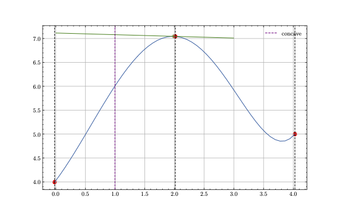

# Data Generation

In order to create process curves with a realistic behaviour of process drifts, `driftbench`
synthesizes curves by solving nonlinear optimization problems. By defining a function $f(w(t), t)$ 
and support points $x$ and $y$, we can solve for the internal parameters $w(t)$ such that 
all the conditions given by the support points are satisfied. The schema is explained in
the following section.



## Synthetization 
In the first step, we need to define latent information which encodes the shape of the curves
to synthesize. This is done by formulating such a spec in a `yaml`-file.
For example, the following spec defines a polynomial of 7-th degree:
```yaml
example:
  N: 10000
  dimensions: 100
  x_scale: 0.2 
  y_scale: 0.2
  func: w[7]* x**7 + w[6]* x**6 + w[5]* x**5 +w[4]* x**4 + w[3] * x**3 + w[2] * x**2 + w[1] * x + w[0]
  w_init: np.zeros(8)
  latent_information:
    !LatentInformation
    x0: [0, 1, 3, 2, 4]
    y0: [0, 4, 7, 5, 0]
    x1: [1, 3]
    y1: [0, 0]
    x2: [1]
    y2: [0]
  drifts:
    !DriftSequence
      - !LinearDrift
        start: 1000
        end: 1100
        feature: y0     
        dimension: 2    
        m: 0.002
```
The root key defines the name of the dataset, in this case `example`.
The other keys of this `yaml` structure are:

- `N`: The number of curves to synthesize.
- `dimensions`: The number of timesteps one curve consists of.
- `x_scale`: The scale of a random gaussian noise which is applied to the `x`-latent information.
If set to 0, no scale noise is applied.
- `y_scale`: The scale of a random gaussian noise which is applied to the `y`-latent information.
If set to 0, no scale noise is applied.
- `func`: The function which defines the shape of a curve. The internal parameters are denoted as
`w`, while the timesteps which are used to evaluate the curve are denoted as `x`.
- `w_init`: The initial guess for the internal parameters. Must match the number of internal
parameters defined in `func`.
- `latent_information`: Contains a `LatentInformation` structure, which holds the latent information
which defines the support points of the curves. The `x_i`denote the `x`-information for the `i`-th
derivative of `func`, while the `y_i`denote the `y`-information respectively.
- `drifts`: Contains a [`DriftSequence`][driftbech.data_generation.drifts.DriftSequence] structure, which in turn holds a list of drifts, for example
`LinearDrift`-structures. These drifts are applied in the specified manner on the latent 
information for each timestep defined as `start` as `end` within the `N` curves. The drift structure 
defines the `feature` and the `dimension` as well as internal parameters, like in this case 
the slope `m`.

After setting up such an input, you can call the `sample_curves`-function, and retrieve the
coefficients, respective latent information and curve for each timestep.
```python
coefficients, latent_information, curves = sample_curves(dataset["example"], measurement_scale=0.1)
```
By specifying a value for `measurment_scale` some gaussian noise witht the specified scale is applied
on each value for every curve. By default, $5\%$ of the mean of the curves is used. If you want to
omit the scale, set it to `0.0` explictly.
