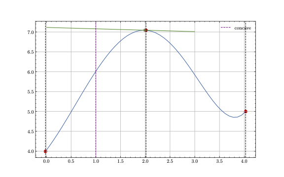

# Data Generation

In order to create process curves with a realistic behaviour of process drifts, `driftbench`
synthesizes curves by solving nonlinear optimization problems. By defining a function $f(w(t), t)$ 
and support points $x$ and $y$, we can solve for the internal parameters $w(t)$ such that 
all the conditions given by the support points are satisfied. The schema is explained in
the following section.



## Synthetization 
In the first step, we need to define latent information which encodes the shape of the curves
to synthesize. This is done by formulating such a spec in a `yaml`-file.
For example, the following spec defines a polynomial of 7-th degree:
```yaml
example:
  N: 10000
  dimensions: 100
  x_scale: 0.2 
  y_scale: 0.2
  func: w[7]* x**7 + w[6]* x**6 + w[5]* x**5 +w[4]* x**4 + w[3] * x**3 + w[2] * x**2 + w[1] * x + w[0]
  w_init: np.zeros(8)
  latent_information:
    !LatentInformation
    x0: [0, 1, 3, 2, 4]
    y0: [0, 4, 7, 5, 0]
    x1: [1, 3]
    y1: [0, 0]
    x2: [1]
    y2: [0]
  drifts:
    !DriftSequence
      - !LinearDrift
        start: 1000
        end: 1100
        feature: y0     
        dimension: 2    
        m: 0.002
```
The root key defines the name of the dataset, in this case `example`.
The other keys of this `yaml` structure are:

- `N`: The number of curves to synthesize.
- `dimensions`: The number of timesteps one curve consists of.
- `x_scale`: The scale of a random gaussian noise which is applied to the `x`-latent information.
If set to 0, no scale noise is applied.
- `y_scale`: The scale of a random gaussian noise which is applied to the `y`-latent information.
If set to 0, no scale noise is applied.
- `func`: The function which defines the shape of a curve. The internal parameters are denoted as
`w`, while the timesteps which are used to evaluate the curve are denoted as `x`.
- `w_init`: The initial guess for the internal parameters. Must match the number of internal
parameters defined in `func`.
- `latent_information`: Contains a `LatentInformation` structure, which holds the latent information
which defines the support points of the curves. The `x_i`denote the `x`-information for the `i`-th
derivative of `func`, while the `y_i`denote the `y`-information respectively.
- `drifts`: Contains a [`DriftSequence`][driftbench.data_generation.drifts.DriftSequence] structure, which in turn holds a list of drifts, for example
`LinearDrift`-structures. These drifts are applied in the specified manner on the latent 
information for each timestep defined as `start` as `end` within the `N` curves. The drift structure 
defines the `feature` and the `dimension` as well as internal parameters, like in this case 
the slope `m`.

After setting up such a specification, you can call the `sample_curves`-function, and retrieve the
coefficients, respective latent information and curve for each timestep.
```python
coefficients, latent_information, curves = sample_curves(dataset["example"], measurement_scale=0.1)
```
By specifying a value for `measurement_scale` some gaussian noise with the specified scale is applied
on each value for every curve. By default, $5\%$ of the mean of the curves is used. If you want to
omit the scale, set it to `0.0` explicitly.

## Vectorized Curve Generation

The curve generation process can be significantly accelerated by using vectorized computation. 
By default, `driftbench` uses JAX's `vmap` (vectorized map) to parallelize the optimization 
across all latent information instances simultaneously, resulting in much faster curve generation 
compared to sequential computation.

### Performance Comparison

| Mode | Description | Use Case |
|------|-------------|----------|
| **Vectorized** (default) | Optimizes all curves in parallel using `vmap` and `jit` | Large datasets, production use |
| **Sequential** | Optimizes curves one-by-one, using previous solution as starting point | Debugging, progress tracking, improved stability |

The vectorized mode is typically **orders of magnitude faster** for large datasets because:

1. JAX compiles the optimization function only once for all instances
2. Operations are batched and executed in parallel on the hardware (CPU/GPU)
3. Memory access patterns are optimized for vectorized operations

However, sequential mode can provide **more stable results** because it uses the solution 
from the previous curve as the starting point for the next optimization. This warm-starting 
approach can lead to smoother transitions across the execution dimension, especially when 
curves are expected to have similar coefficients.

### Using Vectorized Mode

Vectorized computation is enabled by default when using `sample_curves`:

```python
from driftbench.data_generation.sample import sample_curves

# Vectorized mode is used by default - fast computation
coefficients, latent_information, curves = sample_curves(dataset["example"])

# Explicitly enable vectorized mode
coefficients, latent_information, curves = sample_curves(dataset["example"], vectorize=True)
```

### Using Sequential Mode

To use sequential mode with better stability, set `vectorize=False` in `sample_curves`:

```python
from driftbench.data_generation.sample import sample_curves

# Sequential mode - slower but more stable results
coefficients, latent_information, curves = sample_curves(dataset["example"], vectorize=False)

# With a callback to track progress
def progress_callback(i, solution):
    print(f"Curve {i}: coefficients = {solution}")

coefficients, latent_information, curves = sample_curves(
    dataset["example"], 
    vectorize=False, 
    callback=progress_callback
)
```

!!! note
    The `callback` parameter is only supported in sequential mode (`vectorize=False`). 
    When using vectorized mode, the callback is ignored since all curves are computed 
    simultaneously.

### When to Use Each Mode

- **Vectorized mode** (default): Use this for production workloads and when generating 
  large numbers of curves where speed is the priority.
  
- **Sequential mode**: Use this when you need to:
    - Achieve more stable optimization results with smooth coefficient transitions
    - Debug the optimization process
    - Monitor progress with a callback function
    - Investigate individual curve fitting issues
