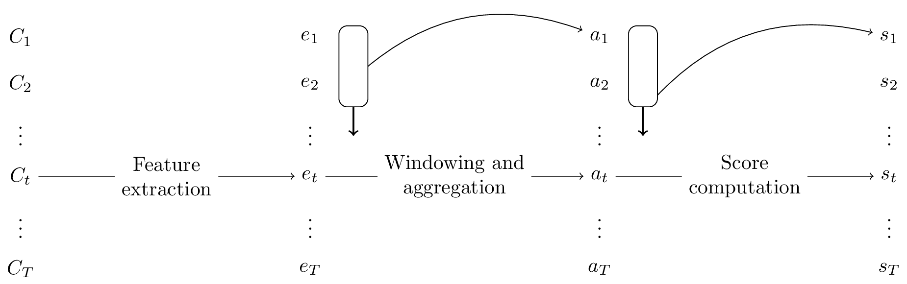

# Detectors

Generally, the detection paradigm of `driftbench` follows the scheme illustrated below. First, features are extracted from each curve, and then aggregations are performed over the temporal axis (often corresponding to process executions) in the resulting latent space.

## Overview
This module provides a collection of drift detectors, ranging from simple baselines to sophisticated
statistical and neural approaches. All detectors inherit from a common 
[Detector](driftbench.drift_detection.detectors.Detector) interface. Here a short overview:

 - [`RandomGuessDetector`][driftbench.drift_detection.detectors.RandomGuessDetector]: Outputs a
   cumulative sum of random Gaussian noise. Acts as a simple baseline for drift detection.
 - [`AlwaysGuessDriftDetector`][driftbench.drift_detection.detectors.AlwaysGuessDriftDetector]: A
   trivial detector that always predicts drift. Useful for debugging or as a degenerate upper bound.
   Provides a simple baseline.
 - [`RollingMeanDifferenceDetector`][driftbench.drift_detection.detectors.RollingMeanDifferenceDetector]:
   Calculates the maximum value over a rolling mean across time and returns the absolute difference
   between subsequent steps.
 - [`RollingMeanStandardDeviationDetector`][driftbench.drift_detection.detectors.RollingMeanStandardDeviationDetector]:
   Applies a rolling mean followed by a rolling standard deviation and returns the result as the
   drift score.
 - [`SlidingKSWINDetector`][driftbench.drift_detection.detectors.SlidingKSWINDetector]:  Implements
   a sliding-window Kolmogorov–Smirnov test to compare distributions of past and recent data
   windows. The size of the windows as well as the offset inbetween can be parametrized.
 - [`MMDDetector`][driftbench.drift_detection.detectors.MMDDetector]: Applies the Maximum Mean
   Discrepancy (MMD) test to compare two samples using kernel methods (multiscale or RBF).
 - [`AggregateFeatureAlgorithm`][driftbench.drift_detection.detectors.AggregateFeatureAlgorithm]:
   Aggregates temporal data (e.g., by computing the mean across time) and applies another drift
   detector to the result which can be set via `algorithm` parameter.
 - [`ClusterDetector`][driftbench.drift_detection.detectors.ClusterDetector]: Applies clustering
   (either KMeans or Gaussian Mixture Model) to the data and uses distance to clusters or
   likelihoods as drift scores.
 - [`AutoencoderDetector`][driftbench.drift_detection.detectors.AutoencoderDetector]:  Uses a neural
   autoencoder to reduce dimensionality of the data, then applies another detector in the latent
   space. Can retrain on each call or reuse the trained model. Hidden layers, activation functions
   and learning rate can be set via parameters as well as the downstream detector (via parameter
   `detector`).
